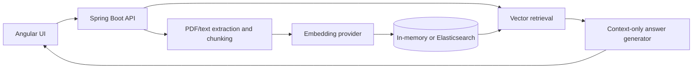

# Production Runbook RAG Assistant

Level 01 retrieval-augmented generation project for answering operational questions from trusted runbooks. It combines a Spring Boot API, Elasticsearch vector search, optional OpenAI generation, and an Angular interface.

## Architecture



Each chunk retains its document name and page number. The generator receives only the top retrieved chunks, treats them as untrusted data, and produces numbered citations that map to source metadata in the API response.

## Features

- PDF and UTF-8 text ingestion with deterministic overlapping chunks
- Local deterministic embeddings for zero-key development
- Optional OpenAI embeddings and Responses API answer generation
- In-memory cosine retrieval or Elasticsearch dense-vector k-NN
- Grounded answers, explicit insufficient-evidence refusal, and page citations
- Offline retrieval evaluation using Hit Rate@K and Mean Reciprocal Rank
- Responsive Angular upload and question-answer interface

## Quick start

Requirements: Java 17+, Node.js 22.22+/24+, and pnpm 11+

Start the backend:

```bash
cd backend
./mvnw spring-boot:run
```

Start the interface in a second terminal:

```bash
cd frontend
pnpm install
pnpm start
```

Open `http://localhost:4200`. The development server proxies `/api` requests to Spring Boot on port 8080.

### Try the included runbook

```bash
curl -F "file=@examples/checkout-runbook.txt" http://localhost:8080/api/v1/documents

curl -X POST http://localhost:8080/api/v1/questions \
  -H "Content-Type: application/json" \
  -d '{"question":"How do I safely restart checkout-api?"}'
```

## API

Upload a document:

```bash
curl -F "file=@checkout-runbook.pdf" http://localhost:8080/api/v1/documents
```

Supported formats: PDF and UTF-8 plain text. Maximum upload size: 10 MB.

```http
POST /api/v1/questions
Content-Type: application/json

{"question":"How do I restart checkout-api?"}
```

```json
{
  "answer": "I could not find enough evidence in the indexed runbooks to answer that question.",
  "citations": [],
  "grounded": false
}
```

Health check: `GET http://localhost:8080/actuator/health`

## Production-style configuration

Start local Elasticsearch:

```bash
docker compose up -d
```

Run the backend with Elasticsearch dense-vector storage and k-NN retrieval:

```bash
cd backend
SPRING_PROFILES_ACTIVE=elasticsearch ./mvnw spring-boot:run
```

The service creates the `runbook-chunks` index automatically with a 256-dimension `dense_vector` field and cosine similarity. Override the connection with `ELASTICSEARCH_URL` and the index name with `ELASTICSEARCH_INDEX`.

| Environment variable | Default | Purpose |
| --- | --- | --- |
| `RAG_EMBEDDING_PROVIDER` | `local` | `local` or `openai` embeddings |
| `RAG_ANSWER_PROVIDER` | `local` | extractive local or `openai` answers |
| `OPENAI_EMBEDDING_MODEL` | `text-embedding-3-small` | embedding model |
| `OPENAI_ANSWER_MODEL` | `gpt-5-mini` | answer-generation model |
| `ELASTICSEARCH_URL` | `http://localhost:9200` | Elasticsearch endpoint |
| `ELASTICSEARCH_INDEX` | `runbook-chunks` | vector index name |

Enable OpenAI embeddings (never commit the key):

```bash
export OPENAI_API_KEY="your-key"
export RAG_EMBEDDING_PROVIDER="openai"
```

Enable OpenAI answer generation using the Responses API:

```bash
export OPENAI_API_KEY="your-key"
export RAG_ANSWER_PROVIDER="openai"
# Optional: export OPENAI_ANSWER_MODEL="gpt-5-mini"
```

The answer prompt treats retrieved text as untrusted data, prohibits outside knowledge, requires `[n]` chunk citations, and refuses to answer when the supplied context is insufficient. API responses also include document/page citation metadata.

Evaluate retrieval quality against a labeled question set:

```bash
curl -X POST http://localhost:8080/api/v1/evaluations/retrieval \
  -H "Content-Type: application/json" \
  -d '{
    "topK": 5,
    "cases": [
      {
        "question": "How do I restart checkout-api?",
        "expectedDocumentName": "checkout-runbook.pdf",
        "expectedPageNumber": 3
      }
    ]
  }'
```

The report includes Hit Rate@K, Mean Reciprocal Rank (MRR), and the first relevant rank for every question. Omit `expectedPageNumber` when any page in the expected document should count as relevant.

## Verification

Run backend tests:

```bash
cd backend
./mvnw test
```

Run frontend tests and the production build:

```bash
cd frontend
pnpm test -- --watch=false
pnpm build
```

## Level 01 completion

- [x] PDF and text ingestion
- [x] Deterministic chunking with document and page metadata
- [x] Embedding generation
- [x] Elasticsearch vector retrieval
- [x] LLM answer generation using retrieved context only
- [x] Source citations and insufficient-context refusal
- [x] Retrieval evaluation with Hit Rate@K and MRR
- [x] Angular document upload and cited-answer interface
- [x] End-to-end verification and documentation

## Scope and next steps

This Level 01 project intentionally uses fixed ingestion and vector retrieval. Authentication, document lifecycle management, reranking, conversational memory, observability, and autonomous tool use are outside this level and are natural follow-on enhancements.
